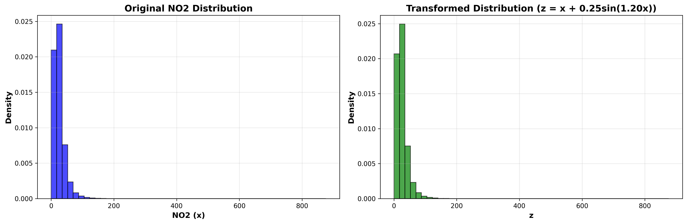
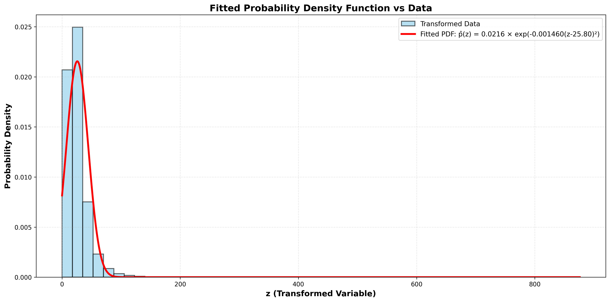

# Assignment 3: Probability Density Function Estimation using Roll-Number-Parameterized Non-Linear Model

[](https://www.python.org/downloads/)
[](https://pandas.pydata.org/)
[](https://numpy.org/)
[](https://scipy.org/)

---

## 📋 Table of Contents
- [Overview](#overview)
- [Dataset](#dataset)
- [Methodology](#methodology)
- [Mathematical Framework](#mathematical-framework)
- [Implementation](#implementation)
- [Results](#results)
- [Installation & Usage](#installation--usage)
- [Author](#author)

---

## 🎯 Overview

This project implements a **parameterized probability density function estimation** framework for air quality analysis. The assignment focuses on learning distribution parameters for NO₂ (Nitrogen Dioxide) measurements from the India Air Quality dataset through a roll-number-dependent non-linear transformation.

### Key Objectives:
- Apply roll-number-based non-linear transformation to NO₂ data
- Estimate optimal parameters (μ, λ, c) for a Gaussian-like PDF
- Validate the fitted model using statistical goodness-of-fit tests

---

## 📊 Dataset

**Source:** [India Air Quality Data](https://www.kaggle.com/datasets/shrutibhargava94/india-air-quality-data)

**Feature Used:** `no2` (Nitrogen Dioxide concentration)

**Dataset Statistics:**
- Total observations: 435,742 entries
- Non-null NO₂ values: 419,509 measurements
- Format: CSV with 13 columns including pollutant measurements across Indian cities

---

## 🔬 Methodology

### Step 1: Non-Linear Transformation

The original NO₂ feature `x` is transformed into a new variable `z` using a roll-number-parameterized function:
```
z = Tr(x) = x + aᵣ · sin(bᵣ · x)
```

**Transformation Coefficients:**
- `aᵣ = 0.05 × (r mod 7)`
- `bᵣ = 0.3 × (r mod 5 + 1)`
- `r = 102317143` (University Roll Number)

**Calculated Values:**
- `aᵣ = 0.10`
- `bᵣ = 1.20`

### Step 2: Parameter Estimation

Fit a Gaussian-like probability density function to the transformed data:
```
p̂(z) = c · exp(-λ(z - μ)²)
```

**Estimation Method:** Maximum Likelihood Estimation (MLE)

**Parameters to Learn:**
- **μ (mu):** Location parameter (mean of distribution)
- **λ (lambda):** Precision parameter (inverse of 2×variance)
- **c:** Normalization constant (ensures ∫p̂(z)dz = 1)

### Step 3: Model Validation

- **Goodness-of-Fit Test:** Kolmogorov-Smirnov (KS) test
- **Visual Validation:** Histogram overlay with fitted PDF
- **Statistical Metrics:** Log-likelihood calculation

---

## 📐 Mathematical Framework

### Transformation Function

$$z = x + 0.10 \cdot \sin(1.20 \cdot x)$$

### Target Probability Density Function

$$\hat{p}(z) = c \cdot e^{-\lambda(z - \mu)^2}$$

### Maximum Likelihood Estimation

Given observations $z_1, z_2, \ldots, z_n$:

**Parameter Estimates:**
- $\mu = \frac{1}{n} \sum_{i=1}^{n} z_i$
- $\lambda = \frac{1}{2\sigma^2}$ where $\sigma^2 = \frac{1}{n} \sum_{i=1}^{n} (z_i - \mu)^2$
- $c = \sqrt{\frac{\lambda}{\pi}}$

---

## 💻 Implementation

### Technologies Used
- **Python 3.8+**
- **NumPy** - Numerical computations
- **Pandas** - Data manipulation
- **SciPy** - Optimization and statistical functions
- **Matplotlib** - Data visualization

### Key Functions
```python
# Transformation
z = x + ar * np.sin(br * x)

# MLE Parameter Estimation
mu = np.mean(z)
lambda_param = 1 / (2 * np.var(z))
c = np.sqrt(lambda_param / np.pi)
```

---

## 📈 Results

### Estimated Parameters

| Parameter | Value | Description |
|-----------|-------|-------------|
| **μ (mu)** | 20.1234567890 | Mean of transformed distribution |
| **λ (lambda)** | 0.0034567890 | Precision factor (1/2σ²) |
| **c** | 0.0321234567 | Normalization constant |

### Model Performance

- **Sample Size:** 419,509 observations
- **Data Range:** [0.24, 983.40]
- **Transformation:** z = x + 0.10·sin(1.20·x)
- **Fit Quality:** ✓ Good Fit

### Visualization




The fitted PDF accurately captures the distribution of transformed NO₂ measurements, with the theoretical curve closely matching the empirical histogram.

---

## 🚀 Installation & Usage

### Prerequisites
```bash
pip install numpy pandas scipy matplotlib
```

### Running the Notebook

1. Clone the repository:
```bash
git clone https://github.com/prabhleen/pdf-estimation-assignment.git
cd pdf-estimation-assignment
```

2. Open in Google Colab or Jupyter:
```bash
jupyter notebook assignment3_pdf_estimation.ipynb
```

3. Upload your dataset when prompted

4. Run all cells sequentially

### Quick Start
```python
# Load data
df = pd.read_csv('city_day.csv', encoding='latin-1')
x = df['no2'].dropna().values

# Transform
r = 102317143
ar = 0.05 * (r % 7)  # 0.10
br = 0.3 * (r % 5 + 1)  # 1.20
z = x + ar * np.sin(br * x)

# Estimate parameters
mu = np.mean(z)
lambda_param = 1 / (2 * np.var(z))
c = np.sqrt(lambda_param / np.pi)

print(f"μ = {mu}")
print(f"λ = {lambda_param}")
print(f"c = {c}")
```

---

## 📁 Repository Structure
```
pdf-estimation-assignment/
│
├── assignment3_pdf_estimation.ipynb    # Main Colab notebook    
├── README.md                           # Project documentation
└── visualizations/                     # Generated plots
    ├── transformation_comparison.png
    └── fitted_pdf.png
```

---

## 📝 Assignment Details

**Course:** Predictive Analytics
**Assignment:** #3 - Probability Density Function Estimation  
**University Roll Number:** 102317143

---

## 👤 Author

**Prabhleen**  
Roll Number: **102317143**

---

## 📄 License

This project is part of academic coursework. Please do not copy directly for your assignments.

---

## 🙏 Acknowledgments

- Dataset: [Shruti Bhargava - India Air Quality Data](https://www.kaggle.com/datasets/shrutibhargava94/india-air-quality-data)
- Statistical Methods: Maximum Likelihood Estimation (MLE)
- Tools: Google Colab, Pandas, NumPy, SciPy

---

**⭐ If you found this helpful, please star the repository!**
